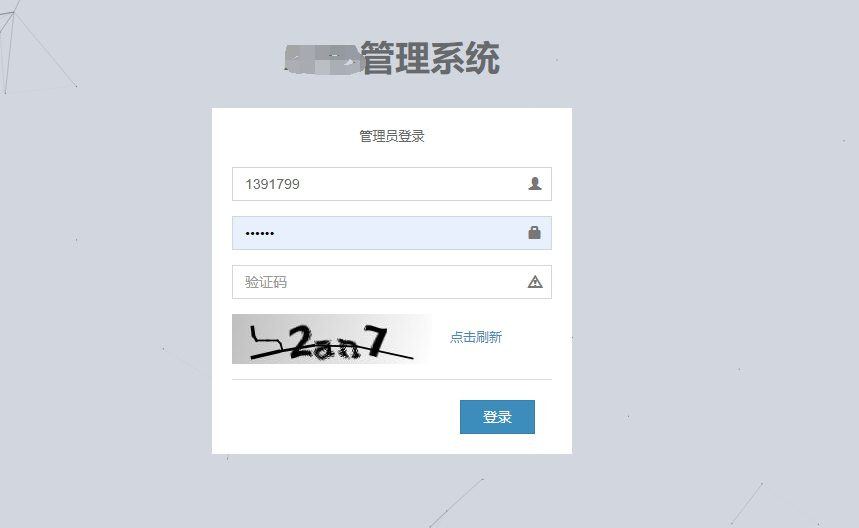
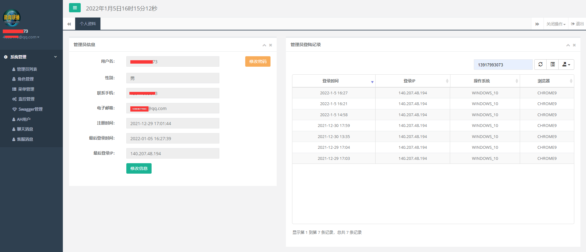
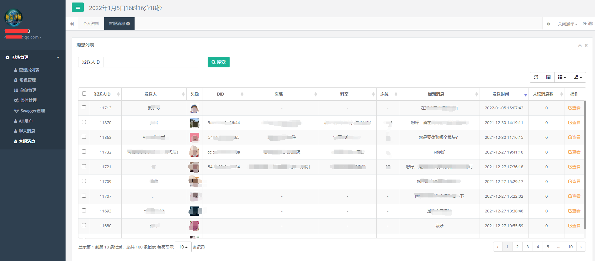
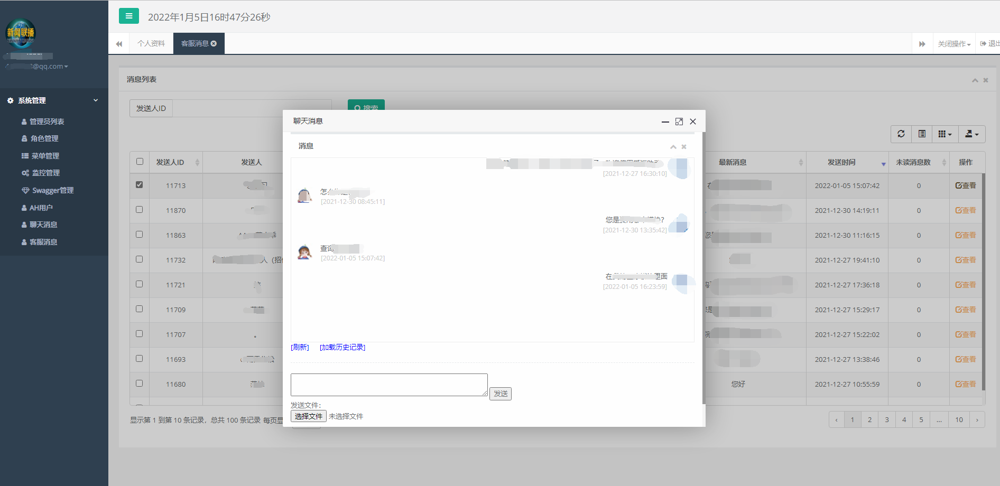

# 快速构建Java企业级应用框架（后台管理+前后端分离接口）
>** SpringBoot + Shiro + Redis/Ehcache+ MyBatisPlus + Mysql（多数据源读写分离）


> **GitHub：[https://github.com/4653478/bootplus](https://github.com/4653478/bootplus)**

> **码云：[https://gitee.com/ajaxliu/bootplus](https://gitee.com/ajaxliu/bootplus)**


------------------

> 欢迎Star本项目，为Java企业开发生态助力，大大节省造轮子的时间，聚焦业务开发

## 介绍

> 本项目扩展于SpringBoot公开项目，根据多年的项目经验，集成了众多实战项目的实用功能：
- 基于SpringBoot + MyBatisPlus的基础框架，可方便的扩展集成SpringCloud微服务；
- 权限验证集成Shiro,实现管理后台账户鉴权/验证码登录/路由白名单等；
- 缓存支持Redis/Ehcache双缓存，根据不同业务场景动态配置不同的缓存类型、缓存淘汰机制（接口级别控制）；
- MyBatisPlus除CRUD快速构建外，支持com.alibaba.fastjson.JSONObject类型灵活搭配前后端接口数据类型，非常灵活；
- 动态配置过滤器、拦截器、监听器、AOP实现 Log、MutiDB等；
- 集成异步定时任务Quartz Task，Cron；
- 封装微信小程序模板信息推送、微信客服代收发等；
- 集成OBS文件上传管理服务，搭配CDN完成前后端文件分发及传输；

> `管理后台` 采用Freemarker/BootStrap。集成了用户管理、角色管理、权限管理、菜单管理，并可快速扩展自定义所需业务页面；

## 项目结构

```lua
bootplus
├── sql  -- 项目SQL语句
│
├── App -- 项目启动类
│
├── common -- 公用模块
|    ├── enums -- 枚举工具类
|    ├── serializer -- 自定义序列化实现
|    ├── typehandler -- 自定义MyBatis类型转换器
│
├── config -- 配置信息
|    ├── aop -- Spring AOP深入实现
|    ├── filter -- 过滤器
|    ├── interceptor -- 拦截器
|    ├── listener -- 监听器
│
├── controller -- 控制器
|    ├── admin -- 后台管理员控制器
│
├── dao -- 数据访问接口
│
├── entity -- 数据持久化实体类
│
├── frame -- 框架公用模块
|    ├── cache -- 缓存模块
|    ├── controller -- 控制器
│
├── service -- 业务逻辑接口
|    ├── impl -- 业务逻辑接口实现类
│
├── shiro -- Shiro验证框架
│
├── task -- 定时任务
│
├── util -- 工具类
|    ├── config -- 公用配置
|    ├── encry -- 加解密模块
|    ├── exception -- 自定义异常
|    ├── file -- 文件工具类
|    ├── freemaker -- 自定义FreeMarker标签
|    ├── http -- http模块实现
|    ├── log -- 日志模块
|    ├── sketch -- 字体、素描、图像
|    ├── spring -- spring公用模块
│
├── resources
|    ├── conf -- 不同环境配置
|    ├── file -- 模板文件
|    ├── jdk_fonts -- JDK字体
|    ├── mapper -- SQL对应的XML文件
│
├── webapp
|    ├── statics -- 静态资源(css、js...)
|    ├── upload -- 上传文件
|    ├── WEB-INF
|    |    ├── templates -- 页面FreeMarker模版
```


## 效果展示






## 技术栈：
- 页面交互：`BootStrap`、`Layer`等
- 核心框架：`Spring Boot `
- 模版引擎：`FreeMarker`
- 安全框架：`Apache Shiro`
- 视图框架：`Spring MVC`
- 持久层框架：`MyBatis`、`MyBatisPlus`
- 缓存技术：`EhCache`、`Redis`
- 定时器：`Quartz`
- 数据库连接池：`Druid`
- 日志实现：`SLF4J`、`Log4j`


## 本地安装演示：
- 修改`application.yml`，更改自己的`MySQL`连接信息,更改自己的`Redis`连接信息
- 项目访问路径：[http://localhost/admin](http://localhost/admin/)
- 管理员账号密码：`admin/admin`
- mysql 数据库初始化（关注以下公众号“娱人码农”后获取）
  
  

## 捐赠
本项目会根据实际项目中用到的技术持续更新，部分高级功能为捐赠后使用；


